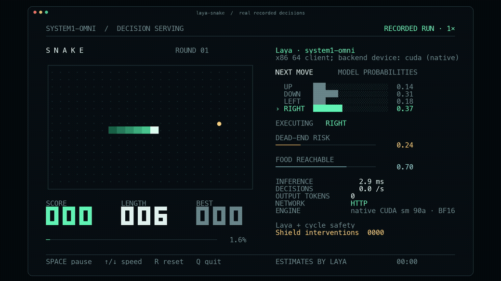
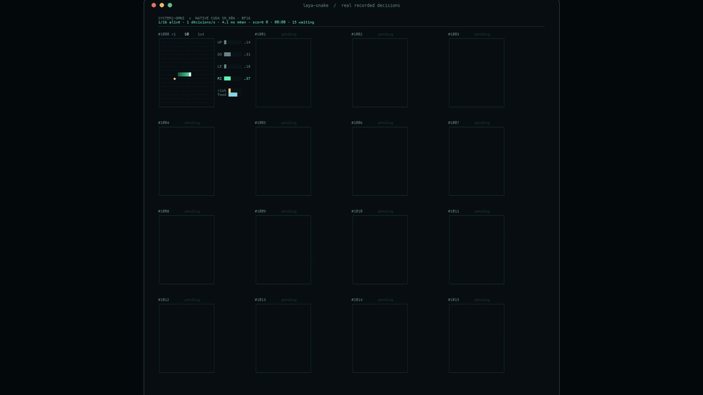

# Play Snake with Laya through a System1-Omni backend

## Summary

Drive the snake game client in [`evals/snake/`](../../evals/snake/) with a `/v1/systemone` decision
backend. Each step the client enumerates the four directions as a `choice` question and adds two `noul`
probes (dead-end risk, food reachability); a deterministic **cycle-safety shield** on the client can
override an unsafe model proposal. The game engine independently scores survival and food — completion
is defined by engine state, not by the model's self-report.

The client is ported from [mizorewww/laya-mlx](https://github.com/mizorewww/laya-mlx) (Apache-2.0, see
`evals/snake/LICENSE-laya-mlx` and `evals/snake/NOTICE`). `snake/policy.py::decide` is verbatim
upstream; only the inference call behind `predict(state, questions)` is replaced by `shim.py`, a thin
bridge to the System1-Omni contract.

This recipe demonstrates real end-to-end serving (frontend + worker + client) with recorded runs.
A smooth episode does not measure decision quality beyond the recorded seeds, and the speed figures
below describe this serving path, not the model's upstream numbers on other hardware.

| Profile | Inference path | Requirements / validation |
|---|---|---|
| omni native worker | `omni-laya` (Rust+CUDA, SM90a) behind `omni-jev` on H800 | Native stack per [System1-Omni's Laya native recipe](https://github.com/ThinkFlowLab/system1-omni/blob/main/recipe/laya/native/README.md); **recorded, see Demo evidence** |
| MPS worker (dev) | `frontend.laya_mps` (PyTorch MPS) on Apple Silicon | [Apple Silicon recipe](https://github.com/ThinkFlowLab/system1-omni/blob/main/recipe/laya/apple-silicon.md); recorded locally for development smoke; ~20× slower per decision than native, expected for the Python path |
| `laya-serve` | Official Python package on CPU/CUDA | [Laya text worker recipe](https://github.com/ThinkFlowLab/system1-omni/blob/main/recipe/laya/README.md); command checked, run not recorded here (see Troubleshooting for the shared-FS caveat) |

## Prerequisites and setup

- System1-Agents checkout containing `evals/snake/` (this branch); System1-Omni checkout at
  `47eff9cd` for the serving stack. Record both revisions with your result.
- Start the backend per the profile's recipe and check readiness:

```bash
curl -s http://127.0.0.1:8000/health
```

For the full serving shape, put the frontend in front of the worker
(`OMNI_JEV_BACKEND_URL=http://127.0.0.1:8000`, frontend on `:8080`) and use its URL as `--backend`.
The port numbers below assume a direct worker on `:8000`.

- Client dependencies, installed into any Python 3.10+ environment:

```bash
pip install rich            # live terminal UI (also imported headless)
pip install pillow          # only for export (replay/tools)
# ffmpeg on PATH            # only for MP4/GIF export
```

## Run the task

All client commands run from `evals/snake/`:

```bash
cd evals/snake
PYTHONPATH=. python -m snake --backend http://127.0.0.1:8000 --model english
```

Headless recording with a paced decision rate (12 decisions/s, good for review):

```bash
PYTHONPATH=. python -m snake --headless --backend http://127.0.0.1:8000 \
  --steps 900 --fps 12 --seed 7 --record runs/snake-seed7.jsonl
```

Many games on one backend (16 concurrent games, the multigrid view):

```bash
PYTHONPATH=. python -m snake multi --backend http://127.0.0.1:8000 \
  --games 16 --fps 12 --steps 600 --seed 1000 --record runs/snake-multi16.jsonl
```

Export any recording to MP4/GIF (plays back at the real recorded speed, `playback_speed: 1`):

```bash
PYTHONPATH=. python -m snake export runs/snake-seed7.jsonl --output runs/snake.mp4 --seconds 40
PYTHONPATH=. python -m snake.multi_replay runs/snake-multi16.jsonl --output runs/multi.mp4 --seconds 50
```

## Verify the result

The client prints a final summary JSON; exit code zero alone is insufficient (an interrupted run also
exits zero). Check the steps budget, deaths and scores explicitly:

```bash
PYTHONPATH=. python - <<'PY'
import json, sys
lines = open("runs/snake-seed7.jsonl").read().splitlines()
end = json.loads(lines[-1])
assert end["type"] == "end", "recording incomplete"
summary = end["summary"]
assert summary["steps"] == 900, summary
assert summary["deaths"] == 0, summary
frames = [json.loads(l) for l in lines if json.loads(l)["type"] == "frame"]
assert len(frames) == summary["inference_calls"], (len(frames), summary["inference_calls"])
print("OK:", summary["steps"], "steps,", summary["deaths"], "deaths,",
      "score", summary["score"], "| interventions", summary["interventions"])
PY
```

`interventions` counts cycle-shield overrides and is expected to be small but nonzero on long runs;
`deaths == 0` with the shield on is the recorded behavior. Re-render one frame of the recording
(`export ... --output check.png`) to confirm the file round-trips through the renderer.

## Demo and validation

Recorded against the native profile (`omni-laya`, SM90a, BF16, checkpoint
`convaiinnovations/laya@55cf4c4` behind `omni-jev`; client co-located over localhost HTTP;
System1-Omni `47eff9cd`). All playback at real recorded speed.





Single game, three 2400-step sessions (seeds 7/23/91), zero deaths:

| Session | duration | decisions/s | score | shield interventions |
|---|---|---|---|---|
| seed 7 | 7.67 s | 312.8 | 55 | 9 |
| seed 23 | 7.67 s | 313.1 | 59 | 11 |
| seed 91 | 7.64 s | 314.0 | 59 | 3 |

Multigrid run: 16 games × 600 steps in 50.0 s — **0 deaths**, aggregate **191.9 decisions/s**,
mean per-decision 8.21 ms including queueing behind the serial worker.

Figures are same-host HTTP client measurements of this recipe's stack, not the model's upstream
numbers and not the CLI matched-batch p50 in System1-Omni's native recipe. The laya-mlx README's
75 moves/s is an M3 Max with the MLX runtime — different machine, different engine.
Backend/frontend parity was checked with System1-Omni's `recipe/compare_with_backend.py` on the
recording stack. Raw recordings and summaries stay with the producing runs; they are not committed
to the repository.

## Troubleshooting and limits

- **Terminal shows a resize message and nothing moves**: the live UI needs at least 104×35;
  resize, or use `--headless` and render later.
- **`--max-speed` is too fast to watch**: cap with `--fps 12` for review videos; max-speed is for
  throughput numbers.
- **UI shows `ENGINE   unknown`**: the backend's `/health` has no torch device fields (native
  worker) or an unrecognized shape; decision behavior is unaffected — unknown is recorded instead of
  guessing an engine.
- **`laya-serve` fails with `safetensors ... Device or resource busy (os error 16)`** on a shared
  filesystem (Lustre/GPFS): set `SAFETENSORS_FAST_GPU=1` (disables mmap loading) before starting it.
- **MPS profile is ~65–70 ms/decision**: expected for the Python path; use it for development, not
  for speed claims.
- The shield hides the model's raw error rate: run `--unassisted` to see unguarded behavior (games
  will die; that is data, not a bug).
- The `detailed` prompt needs a checkpoint context larger than 512 tokens; the native profile
  serves the 512-token English checkpoint — use the default `compact` prompt there.

## References

- Client port and game: [mizorewww/laya-mlx](https://github.com/mizorewww/laya-mlx),
  `evals/snake/NOTICE` for the modification list.
- Serving stack: [System1-Omni Laya native recipe](https://github.com/ThinkFlowLab/system1-omni/blob/main/recipe/laya/native/README.md),
  [supported models](https://github.com/ThinkFlowLab/system1-omni/blob/main/docs/supported-models.md).
- Demo conventions: [Agent video demos](../../CONTRIBUTING.md#agent-video-demos),
  [recipes index](../README.md).
